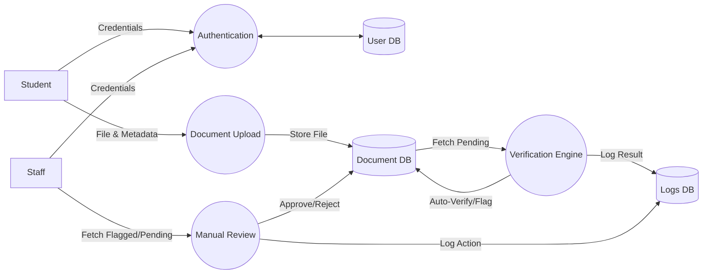
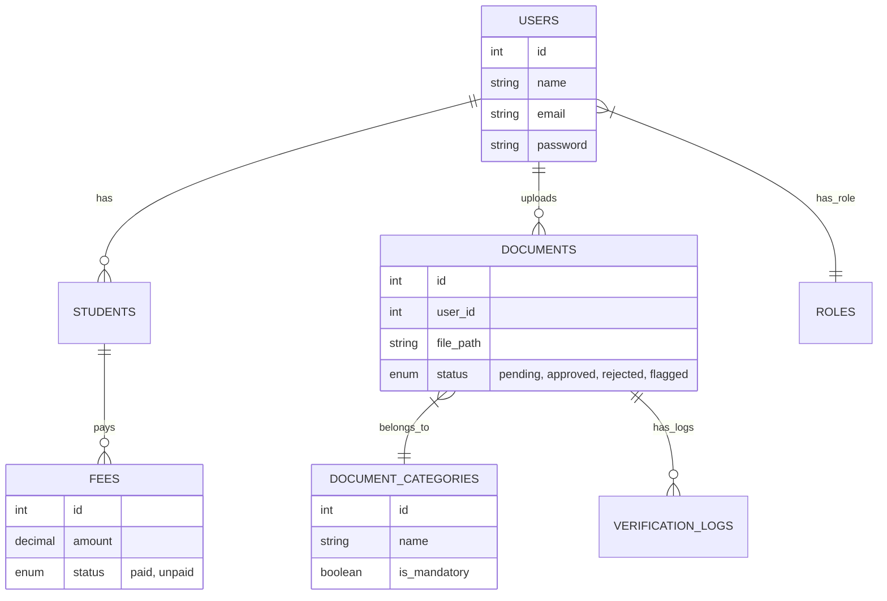

# Project Proposal: Automated Student Documentation System (StudentDocs)

## 1. Executive Summary
**StudentDocs** is a secure, web-based platform designed to streamline the academic documentation workflow. It automates the submission, verification, and management of student files (e.g., Admission Letters, Transcripts, ID Cards) and fee payments.

By digitizing manual processes, this system reduces administrative workload, ensures data integrity through automated consistency checks, and provides students with a transparent, real-time tracking dashboard.

---

## 2. Problem Statement
Traditional student documentation processes face several challenges:
*   **Inefficiency:** Manual submission and physical filing consume excessive time and space.
*   **Lack of Transparency:** Students are often unaware of their document status (missing, lost, or pending).
*   **Verification Bottlenecks:** Staff must manually check thousands of documents for basic validity (size, type, legibility).
*   **Data Redundancy:** Disconnected systems for fees and documents lead to inconsistent student records.

## 3. Proposed Solution
**StudentDocs** addresses these issues through a centralized portal with three distinct modules:
1.  **Student Module:** For uploading documents, paying fees, and downloading generated ID cards/Letters.
2.  **Staff Module:** A verification dashboard with automated pre-checks and manual approval tools.
3.  **Admin Module:** For system configuration, user management, and high-level reporting.

**Key Innovation:** An **Automated Verification Engine** that pre-scans documents for file type, size compliance, image resolution, and naming consistency before human review.

---

## 4. System Architecture

The system follows a Model-View-Controller (MVC) architectural pattern using the **Laravel Framework**.

```mermaid
graph TD
    User((User))
    LB[Load Balancer / Web Server]
    
    subgraph "Application Layer (Laravel)"
        Auth[Authentication Service]
        DocController[Document Controller]
        VerifyService[Verification Engine]
        PayService[Payment Service]
    end
    
    subgraph "Data Layer"
        DB[(MySQL Database)]
        Storage[File Storage (Local/S3)]
    end

    User -->|HTTPS| LB
    LB --> Auth
    Auth --> DocController
    DocController -->|Upload| Storage
    DocController --> VerifyService
    VerifyService -->|Status Update| DB
    PayService -->|Transaction| DB
```

---

## 5. System Diagrams

### 5.1 Use Case Diagram
This diagram illustrates the interactions between the three primary actors (Student, Staff, Admin) and the system features.

```mermaid
usecaseDiagram
    actor Student
    actor Staff
    actor Admin

    package "StudentDocs System" {
        usecase "Upload Documents" as UC1
        usecase "View Status Dashboard" as UC2
        usecase "Pay School Fees" as UC3
        usecase "Download ID Card/Letter" as UC4
        
        usecase "Verify Documents" as UC5
        usecase "View Student Profiles" as UC6
        
        usecase "Manage Users & Roles" as UC7
        usecase "View System Reports" as UC8
        usecase "Manage Document Categories" as UC9
    }

    Student --> UC1
    Student --> UC2
    Student --> UC3
    Student --> UC4

    Staff --> UC5
    Staff --> UC6

    Admin --> UC7
    Admin --> UC8
    Admin --> UC9
    Admin --> UC5
```

### 5.2 Data Flow Diagram (DFD) - Level 1
Shows how data flows through the system's core processes.



### 5.3 Entity-Relationship (ER) Diagram
The database schema structure identifying entities and their relationships.



---

## 6. Detailed Feature Descriptions

### A. Automated Verification Engine
Before a staff member sees a document, the system runs a rule-based check:
1.  **File Integrity:** Rejects corrupted files or disallowed extensions (EXE, BAT).
2.  **Size Compliance:** Enforces 100KB - 5MB limits.
3.  **Resolution Check:** Flags images below 600x600px as "Low Quality".
4.  **Identity Heuristic:** Warns if the filename does not match the student's name pattern.

### B. Document Generation
Students who have cleared their fees and verification can automatically generate official PDF documents:
*   **Provisional Admission Letter**
*   **Student ID Card** (with QR Code placeholder)
*   **Academic Transcript**

### C. Financial Integration
Integrated fee management ensures students cannot access sensitive documents (like Transcripts) until their financial obligations are met.

---

## 7. Technology Stack
*   **Backend:** PHP 8.2 (Laravel 11)
*   **Frontend:** Blade Templates, Bootstrap 5, JavaScript
*   **Database:** MySQL 8.0
*   **Security:** CSRF Protection, XSS Filtering, Role-Based Access Control (RBAC)

---

## 8. Installation & Setup

### Prerequisites
*   PHP >= 8.2, Composer, MySQL, Node.js

### Quick Start
1.  **Clone & Install:**
    ```bash
    git clone <repo>
    composer install && npm install
    ```
2.  **Environment:**
    ```bash
    cp .env.example .env
    php artisan key:generate
    ```
3.  **Database & Seed:**
    ```bash
    php artisan migrate --seed
    ```
4.  **Run:**
    ```bash
    npm run dev
    php artisan serve
    ```

---
*Generated for Project Proposal Specification - 2026*
